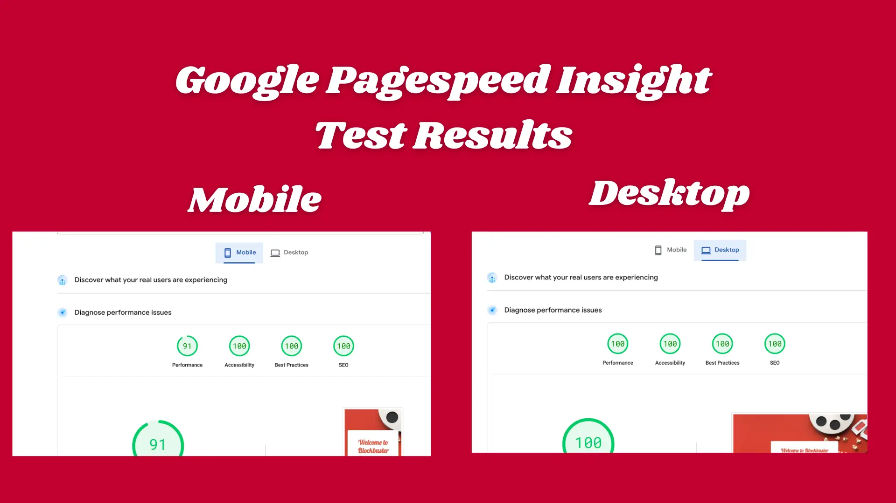

# Blockbuster Brainbuster

**Blockbuster Brainbuster** is an interactive movie quiz game designed to test movie buffs' knowledge of film history and pop culture. Players will be presented with a series of randomly selected questions about movies, ranging from classic films to modern blockbusters. The quiz includes three difficulty levels—Easy, Medium, and Hard—with varying numbers of hints available, making it a fun and challenging game for movie enthusiasts of all levels. The goal is to answer as many questions correctly as possible, with users earning points for each correct answer.

### Project Goals
The **Blockbuster Brainbuster** game is designed to entertain movie lovers while also providing an educational experience about film history. The game aims to engage users through fun, trivia-style gameplay, encouraging them to expand their knowledge of movies. Targeting a wide audience of movie fans, from casual viewers to hardcore cinephiles, this quiz offers an easy-to-play but challenging format that rewards quick thinking and movie knowledge.

The website has been developed to be fully responsive, ensuring the quiz is enjoyable on all devices, from desktop to mobile. The clean layout allows users to focus on the quiz without distractions, providing an intuitive and immersive experience whether playing on a large screen or a small mobile device.

---

## Features

### Existing Features

- **Landing Page**
  -The landing page provides a welcoming introduction to the quiz, featuring a catchy tagline, a brief description, and a prominent "Start Quiz" button to get users into the game quickly. -The page also includes a visual theme based on popular movie elements, engaging users right from the start with appealing imagery.

- **Mute Button**
  - The Blockbuster Brainbquiz quiz has a mute button to mute the sounds. The sounds are audio feedback for the user to see if they got the question right or wrong.
  - By default, the mute button is set to mute when the quiz loads up. The mute button can be found at the top right of any screen.

- **Start Screen**
  - The start screen allows users to choose their desired difficulty level (Easy, Medium, or Hard). This decision determines how many hints will be available during the quiz.
  - The difficulty selection ensures that players can customize the challenge according to their movie knowledge and skill level. 
  

- **Randomised Question Generator**
  - The game selects 10 random questions from a pool of 30, so each quiz session is unique and offers a fresh challenge each time.
  - Each question has multiple-choice answers, and players must select the correct option to score points.

- **Hint System**
  - Based on the selected difficulty, the player will receive a set number of hints. On **Easy** difficulty, 2 hints are provided, while **Medium** offers 1 hint. **Hard** does not offer any hints.
  - Hints are designed to provide brief clues to help the player deduce the correct answer, ensuring the game remains challenging while still offering some assistance.

  

- **Score Display**
  - After the player answers all 10 questions, the final score is displayed. The score reflects how many questions were answered correctly.
  - Players are encouraged to share their scores with friends or try to beat their own best score.

- **Ending Screen**
  - The ending screen shows the player’s final score and options to either restart the quiz or return to the home page.
  - This section reinforces the idea of replayability, encouraging users to play again and improve their scores.
  
  

- **Instructions and Help**
  - The quiz includes a section with instructions on how to play, explaining the hint system, and the overall gameplay mechanics.
  - This ensures that new users can easily understand how to start and navigate the game.

---

## Features That Could Be Implemented in the Future
The application is a finished product ready to go out to the masses. Looking forward to future updates, these features could be deployed - 
- **Leaderboard**: A global leaderboard system that records and displays the highest scores achieved by players.
- **User Authentication**: Allow players to create accounts and track their progress across multiple sessions, storing their highest scores and quiz history.
- **Question Pool Expansion**: Add more questions to the pool, increasing the variety and challenge for players over time.
- **A timer**: - Adding a timer would bring a sense of urgency and make the user think quickly. Increasing the challenge of the quiz.

---

## Testing

The **Blockbuster Brainbuster** game has undergone extensive testing to ensure all features are working as expected and that the user experience is smooth.

- **Functionality**: The quiz's core features (random question generation, hint system, and score tracking) work as intended. The questions are randomized with each game session, and the hints appear based on the selected difficulty.
- **Browser Compatibility**: The game has been tested on multiple browsers (Chrome, Firefox, Safari, Edge) and is fully functional across these platforms.
- **Mobile Responsiveness**: The game interface is responsive and provides an optimal experience on mobile devices.
- **Unfixed Bugs**: During testing, no significant bugs were left unfixed. 
- **Device testing**: Tested not only on different sizes in developer tools but also on different devices, including tablets and mobile phones. These included Android and iOS devices. As well as tablets including iPads and Android tablets.
- **Page Speed Insights Test**: The application scored very highly on the Google Page Speed Insight test. 
- It got a perfect 100 score for the desktop site for performance, accessibility, best practices, and SEO.  
- The mobile version got a 91 for performance and a 100 for everything else which is great. See the results in the image below. -

---

## Validator Testing

- **HTML**: No errors were returned when passing through the official [W3C HTML validator](https://validator.w3.org/nu/?doc=https%3A%2F%2Fnickflanagn24.github.io%2Fblockbuster-brainbuster%2F). 
- **CSS**: No errors were returned when passing through the official [W3C Jigsaw CSS validator](https://jigsaw.w3.org/css-validator/validator?uri=https%3A%2F%2Fnickflanagn24.github.io%2Fblockbuster-brainbuster%2F&profile=css3svg&usermedium=all&warning=1&vextwarning=&lang=en)
- **Javascript**: No warnings were found when using [JSHint](https://jshint.com/). JSHint did flag up 2 unused bits of code. This is because unused variables are functions, and called using onClicks in the the HTML file.

- **Wave Testing Tool**: There were no errors when running the site through [Wave Testing tool](https://wave.webaim.org/report#/https://nickflanagn24.github.io/blockbuster-brainbuster/)

---

## Deployment

The **Blockbuster Brainbuster** quiz has been deployed using **GitHub Pages**. Below are the steps taken to deploy the project:

1. In the GitHub repository, navigate to the **Settings** tab.
2. From the **Source** section, select the **Main Branch**.
3. Once selected, the page automatically refreshes, confirming the successful deployment.
4. The live website can be accessed [here](https://nickflanagn24.github.io/blockbuster-brainbuster/).

---

## Bugs & Fixes
1.**Mute Button Visibility Issue**

**Bug**: The mute button is only displayed on the quiz screen, disappearing on other screens.

**Fix**: Moved the mute button to be outside the quiz container so it’s always visible. Updated CSS to position it consistently across screens.

2.**Question Image Display Issue**

**Bug**: Images for questions were not displaying due to incorrect HTML string formatting in JavaScript.

**Fix**: Corrected the innerHTML assignment for questionImage to properly set the src attribute with ${questionData.image}. Ensured correct syntax by closing quotes within the template string.

3.**Contrast Accessibility Errors**

**Bug**: Text and button colors were too low in contrast, failing accessibility standards.

**Fix**: Updated CSS with higher-contrast colors (e.g., light text on dark backgrounds) and brightened buttons to enhance visibility. Applied text shadows to improve readability over images.

4.**JavaScript Function Errors** (Uncaught ReferenceError)

**Bug**: Uncaught ReferenceErrors due to undefined or misnamed variables within functions.

**Fix**: Verified variable names were consistent and initialized before use. Added console logging for debugging and isolated missing variables.

5.**End Screen Not Displaying Final Score**

**Bug**: The final score was not visible on the end screen.

**Fix**: Updated the showEndScreen() function to retrieve the latest score and inject it into the end screen’s score display element.

6.**Incorrect Answer Feedback Delayed**

**Bug**: Feedback for correct/incorrect answers (e.g., color changes) wasn’t appearing until the next question loaded.

**Fix**: Added a short timeout before advancing to the next question, allowing time to display feedback, and used setTimeout() to briefly show whether the answer was correct or incorrect.

7.**Navigation Between Screens**

**Bug**: Navigation buttons caused unexpected behavior when clicked multiple times or too quickly.

**Fix**: Added debounce functionality to navigation buttons to prevent multiple rapid clicks. Also disabled buttons temporarily during transitions.

---

## Credits

### Content
- The movie questions were created and written by the project team, focusing on a broad range of films from different genres and eras.
- Instructions and gameplay mechanics were designed by the project team.

### Media
- The images used throughout the website were sourced from [Film Grab](https://film-grab.com/), focusing on movie-themed visuals such as iconic film scenes. 
- All other images were produced in [Canva](https://www.canva.com/).
- The fonts were sourced from [Font Awesome](https://fontawesome.com).

---

Thanks for checking out the **Blockbuster Brainbuster** quiz! This project is an engaging and interactive game, offering an enjoyable challenge for movie lovers. The structure and planning behind the quiz have a solid foundation for future expansion, with the possibility of incorporating additional features. 
